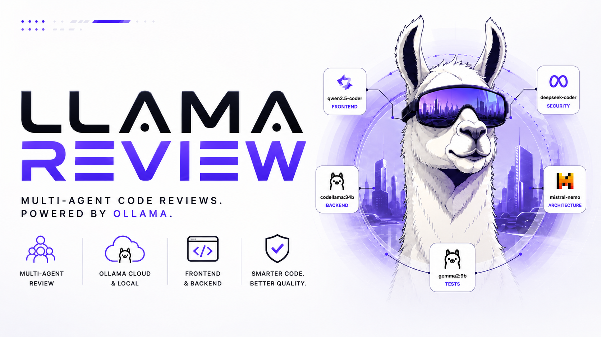

# Llama Review

[](LICENSE)  



🫟 **[Live demo → sonto.space/llama-review](https://sonto.space/llama-review/)**

Different models have different strengths. Llama Review assigns the right model to the right task.

Five review lanes, each running on a model chosen for that domain:

- **Qwen 3.5**: frontend review with vision, layout checks, state management, accessibility
- **GLM-5.1**: backend bugs, N+1 queries, race conditions, unhandled exceptions, architecture
- **Kimi K2.6**: security across large diffs using a 262K context window
- **DeepSeek V4-Flash**: test gaps, broken assertions, coverage holes
- **MiniMax M2.7**: dead code, duplicate logic, over-engineering

Results merge, deduplicate, and rank into a single report.

## What you get

- **Critical**: security holes, data loss risks, auth bypasses
- **Needs attention**: real bugs, edge cases, performance regressions, unnecessary complexity
- **Noted**: things that passed, lanes that found nothing, low-confidence flags
- **Models Used**: which model ran each lane, effort level, and result
- **Suggested test commands**: what to run to verify the changes
- **One-paragraph summary**: ready to paste into a PR or Slack
- **Structured JSON output**: `--json` flag writes machine-readable findings to a file
- **Next Steps**: concrete subagent commands to fix each finding

Every finding has the file, line, what's broken, and how to fix it. No generic filler.

## Verdict

Every run ends with one verdict, derived from the ranked findings:

| Verdict | When | Exit code |
|---------|------|-----------|
| **BLOCK** | any critical finding | `2` |
| **REVIEW** | only needs-attention items | `0` |
| **CLEAN** | nothing actionable | `0` |

```
## Verdict: BLOCK
1 critical, 4 to review · fix before merge (exit 2)
```

Pass `--strict` to also block on needs-attention items (REVIEW becomes BLOCK, exit `2`) — useful as a CI gate. The verdict is included in `--json` output under the `verdict` key.

## Install

```
/plugin marketplace add artttj/llama-review
/plugin install llama-review
/reload-plugins
```

Then run:
```
/llama-review
```

Requires the `ollama` CLI on PATH and Node.js 18+ (bundled with Claude Code). On first run without a config file, llama-review offers to create `.llama-review.yml` from defaults.

## Usage

```
/llama-review                                        # defaults: all lanes, origin/main, normal effort
/llama-review target=origin/staging                  # diff against a branch
/llama-review lanes=frontend,security               # only specific lanes
/llama-review --local                               # use local ollama models
/llama-review --init                                # create .llama-review.yml from defaults
/llama-review --effort deep                         # 64k tokens per lane
/llama-review --jira                                # append a Jira comment block
/llama-review --json                               # write structured findings to JSON file
```

The `llama-review.mjs` script handles the full pipeline: detects changed files with `git diff`, applies exclude patterns, auto-assigns files to lanes by pattern, scales token budgets by diff size, dispatches parallel Ollama API calls with per-lane timeout and retry, handles thinking model output (falls back to `message.thinking` when `message.content` is empty), parses structured JSON output with text fallback, then merges and ranks the findings.

## Configuration

Drop a `.llama-review.yml` in your project root:

```yaml
# Global exclude patterns — strip from diff before dispatch
exclude:
  - "packages/exercises/src/data/exercises/**"
  - "**/seed.sql"
  - "**/messages.js"
  - "**/messages.po"

models:
  frontend: "qwen3.5:cloud"
  backend: "glm-5.1:cloud"
  security: "kimi-k2.6:cloud"
  tests: "deepseek-v4-flash:cloud"
  simplify: "minimax-m2.7:cloud"

effort:
  quick: 8000
  normal: 32000
  deep: 64000

local: false

# Per-lane overrides
lane_config:
  backend:
    timeout: 240    # seconds
    retries: 1
    thinking: true  # increase num_predict for reasoning models
  security:
    timeout: 180
    retries: 1
    thinking: true

# Custom lanes
lanes:
  infra:
    files: "terraform/**, docker/**, .github/**, k8s/**"
    focus: "misconfigured resources, missing secrets, unsafe defaults"
    model: "kimi-k2.6:cloud"
    timeout: 180
    retries: 1
```

Set a lane's model to `false` to disable it. Custom lanes extend the built-in ones.

## Custom prompt templates

Override the review prompt for any lane by creating a markdown file:

- **User-level** (all projects): `~/.claude/skills/llama-review/prompts/<lane>.md`
- **Project-level**: `<project-root>/.llama-review/prompts/<lane>.md`

For example, `.llama-review/prompts/security.md` replaces the built-in security prompt. User-level files take priority over project-level. If neither exists, the built-in default is used.

## Review lanes

| Lane | Files | Default model | Type | Why this model |
|------|-------|---------------|------|----------------|
| frontend | `*.tsx, *.jsx, *.vue, *.svelte, *.astro, *.css, *.scss, *.less, *.html, *.mdx, *.d.ts, *.j2, *.twig, *.blade.php, templates/` | qwen3.5:cloud | cloud | Vision + thinking + tools for UI review |
| backend | `*.php, *.py, *.rb, *.go, *.java, *.rs, *.kt, *.ts, *.js, *.cs, *.scala, *.c, *.cpp, *.h, *.hpp, *.sql, *.graphql, *.proto, *.tf` (excludes test and frontend files) | glm-5.1:cloud | cloud | Strongest code reasoning, 9.5/10 |
| security | all files | kimi-k2.6:cloud | cloud | 262K context for full attack surface review |
| tests | `*.test.*, *_test.*, *.spec.*, *_spec.*, *.phpunit.*, *.cy.*, *.e2e.*, *.integration.*, *.stories.*, tests/, __tests__/, spec/` | deepseek-v4-flash:cloud | cloud | Fast structured analysis |
| simplify | all files | minimax-m2.7:cloud | cloud | Cheap pattern matching for dead code and over-engineering |

Each lane only gets files matching its patterns. Security and simplify always get the full diff. Empty lanes are skipped. Files are auto-assigned by the script — no manual categorization needed.

## Model setup

### Cloud models (default)

Models with the `:cloud` suffix are dispatched through the standard Ollama HTTP API (`/api/chat`). The suffix is a naming convention — there is no separate cloud endpoint or proxy. Both cloud and local models hit the same `OLLAMA_HOST`.

This means cloud models only work if your Ollama server actually serves a model with that name. Plain `ollama serve` won't have them unless you've set up a proxy or custom model names. If a cloud model is unavailable, the lane fails and reports the error.

To make cloud models work, point `OLLAMA_HOST` to an Ollama-compatible server that serves them:

```bash
OLLAMA_HOST=https://your-proxy.example.com /llama-review
```

Or run locally with `--local` instead.

### Local models

Pass `--local` to strip `:cloud` suffixes and dispatch to your local Ollama instance. If a local model isn't pulled, the lane fails and reports the error.

```bash
ollama pull qwen3:8b    # example
/llama-review --local
```

Recommended local models:
- `qwen3:8b`: fits in 8GB VRAM, good for quick reviews
- `deepseek-r1:14b`: reasoning-focused, good for security lanes
- `devstral:24b`: agentic coding, good for backend lanes

## License

MIT. See [LICENSE](LICENSE).